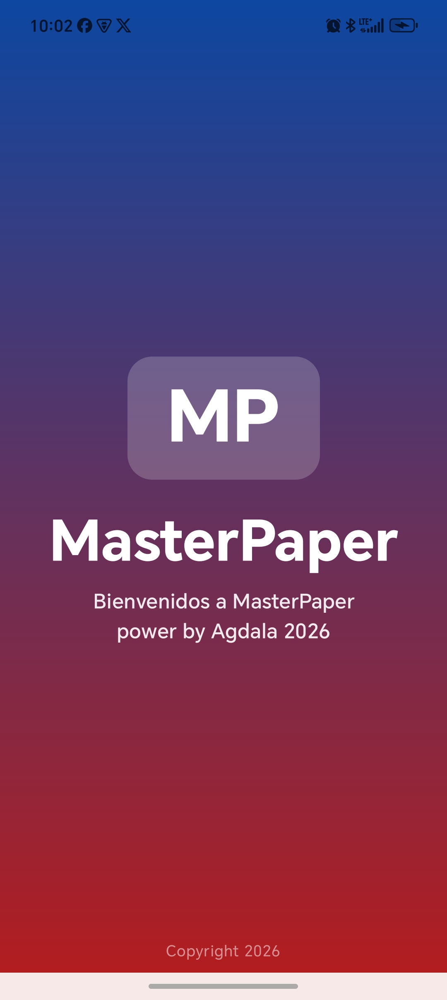
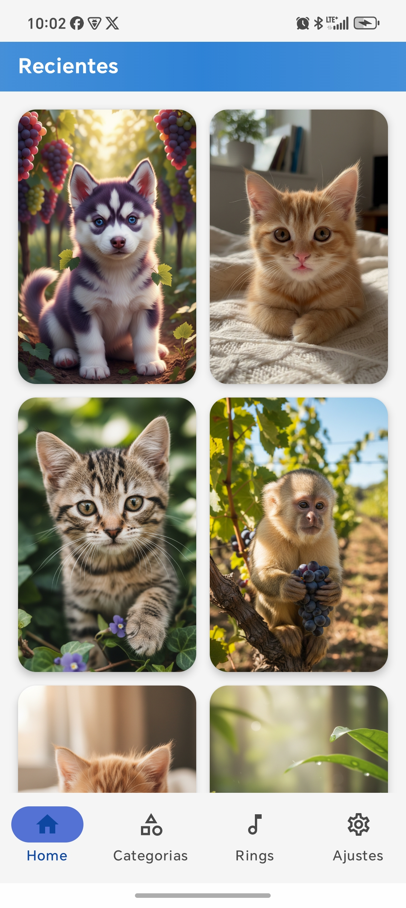
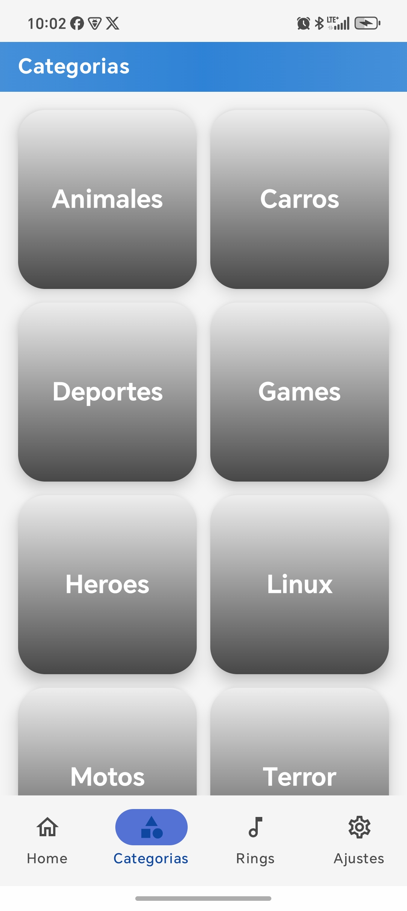
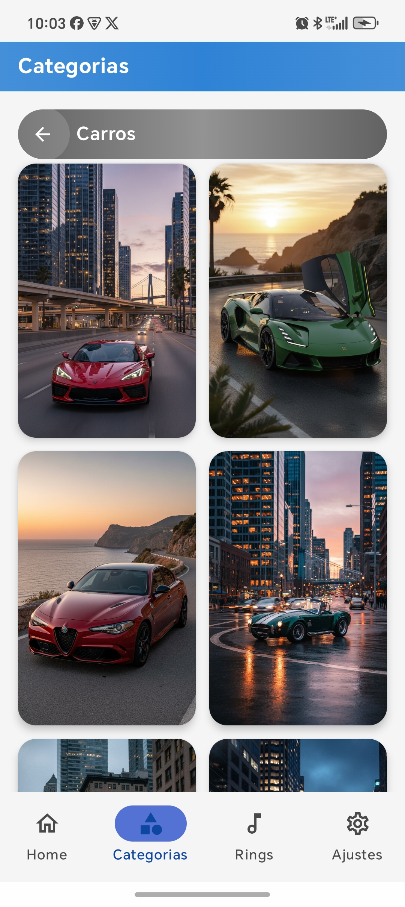
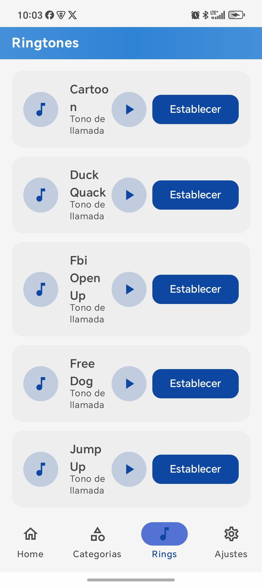
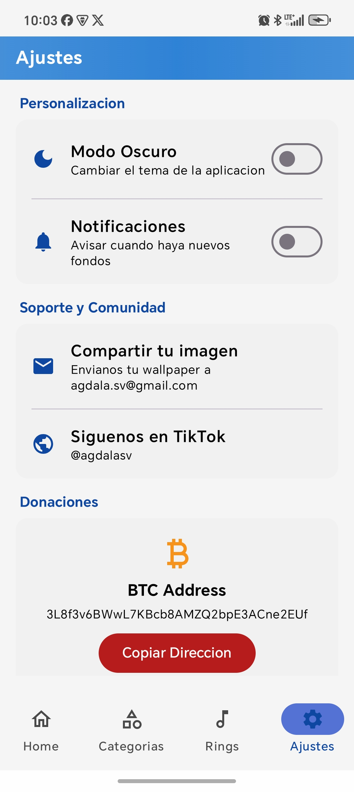

# MasterPaper

<p align="center">
  
</p>

<p align="center">
  <a href="https://github.com/agdalasv/MasterPaper/releases">
    
  </a>
  <a href="https://github.com/agdalasv/MasterPaper/blob/master/LICENSE">
    
  </a>
  <a href="https://github.com/agdalasv/MasterPaper/actions">
    
  </a>
</p>

---

## Descripción

**MasterPaper** es una aplicación Android de wallpapers en vivo y estáticos, construida con Jetpack Compose y arquitectura MVVM. Permite explorar, previsualizar y establecer wallpapers directamente desde un repositorio de GitHub.

### Características

- 📱 **Wallpapers en Vivo**: Disfruta de animated backgrounds con soporte de video
- 🖼️ **Galería de Imágenes**: Explora wallpapers estáticos por categorías
- 🎵 **Ringtones**: Descarga tonos de llamada desde GitHub
- 🔔 **Notificaciones de Actualizaciones**: Recibe notificaciones cuando haya nuevo contenido
- 🌙 **Modo Oscuro**: Soporte completo para tema oscuro
- ⚡ **Glass Effect**: Interfaz moderna con efecto glass morphism
- 🚀 **Carga Rápida**: Imágenes optimizadas con caché

---

## Capturas de Pantalla

<div align="center">
  
  
  
  
  
  
</div>

---

## Tecnologías

| Categoría | Tecnología |
|-----------|-------------|
| **Lenguaje** | Kotlin |
| **UI** | Jetpack Compose + Material 3 |
| **Arquitectura** | MVVM + Clean Architecture |
| **Networking** | Retrofit + OkHttp |
| **Imágenes** | Coil |
| **Video** | Media3 ExoPlayer |
| **Almacenamiento** | DataStore Preferences |
| **Background** | WorkManager |
| **Navegación** | Navigation Compose |

---

## Requisitos

- **Android SDK**: 35 (Android 15)
- **Min SDK**: 26 (Android 8.0)
- **Gradle**: 9.3.1
- **Kotlin**: 1.9.24

---

## Configuración

1. **Clona el repositorio**:
   ```bash
   git clone https://github.com/agdalasv/MasterPaper.git
   ```

2. **Configura el token de GitHub** (opcional para repositorios públicos):
   Crea un archivo `local.properties` en la raíz del proyecto:
   ```properties
   sdk.dir=/ruta/a/tu/Android/Sdk
   GITHUB_TOKEN=tu_token_aqui
   ```

3. **Construye el proyecto**:
   ```bash
   ./gradlew assembleDebug
   ```

4. **Instala la APK**:
   ```bash
   adb install app/build/outputs/apk/debug/app-debug.apk
   ```

---

## Estructura del Proyecto

```
app/
├── src/main/
│   ├── java/com/masterpaper/
│   │   ├── data/              # Capa de datos
│   │   │   ├── model/        # Modelos de datos
│   │   │   ├── remote/       # API services
│   │   │   └── repository/   # Repositorios
│   │   ├── di/               # Inyección de dependencias
│   │   ├── ui/               # Capa de presentación
│   │   │   ├── components/   # Componentes reutilizables
│   │   │   ├── navigation/   # Navegación
│   │   │   ├── screens/      # Pantallas
│   │   │   └── theme/        # Temas
│   │   ├── viewmodel/        # ViewModels
│   │   ├── wallpaper/        # Servicio de Live Wallpaper
│   │   └── worker/           # WorkManager workers
│   └── res/                  # Recursos
└── build.gradle.kts          # Build configuration
```

---

## Licencia

Este proyecto está bajo la Licencia MIT. Consulta el archivo [LICENSE](LICENSE) para más detalles.

---

## Descargas

📥 [Descargar APK](https://agdalasv.github.io/MasterPaper/)

---

<p align="center">
  <sub>Hecho con ❤️ por <a href="https://github.com/agdalasv">agdalasv</a></sub>
</p>